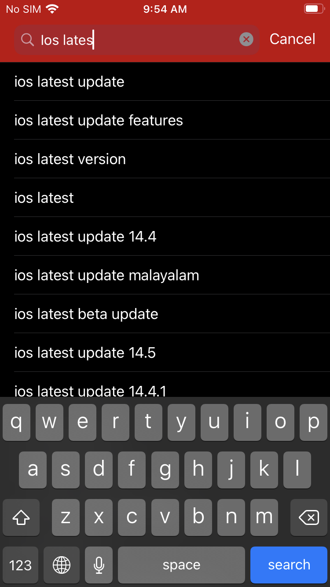

# YT Private Subscriptions

An app which lets users to subscribe to channels and see the feed without logging in.

This is an app which allows users to privately subscribe to YouTube channels and watch videos without ever needing a login, perfect for those who fear that YouTube algorithm might add random unrelated videos to their feed in suggestions if they ever want to try out new content.

With this app, you can now start exploring the content and then subscribe to the ones you only need and want to continue with.

**The app supports iOS 12.0 and above**

## How to use

Upon the first launch, the app opens in a screen with two tabs in the bottom. The first screen lists the subscriptions you have and the second screen allows you to search for your videos.

  - [x] Search for your videos from 'Explore' screen
    - [x] Searching will also show the familiar search suggestions that you get in YouTube
  - [x] Tap on a video listing to go to the 'Player' screen and play videos
    - [x] You can manage your subscription from the player screen with that button
  - [x] See the latest uploads of your subscriptions in the 'Subscriptions' screen
  
## Setting up for development

What you'll need:

  - [ ] macOS Mojave 10.14.4 or later
  - [ ] Xcode 10.2 or later
  - [ ] Cocoapods gem
  - [ ] An API key for YouTube Data API v3 (for Udacity reviewers, this will be provided at time of submission for your convenience)

The steps to setup are as follows.

  1. Clone this repository into your computer
  2. Run `pod install` to install dependencies (not necessarily needed since we check-in Pods directory too)
  3. Open the "YT Private Subscriptions.xcworkspace" file (directory?) in Xcode
  4. Edit 'YouTubeApis.swift' file and replace `YOUTUBE_API_KEY` value with your API key
  
And you are done!
